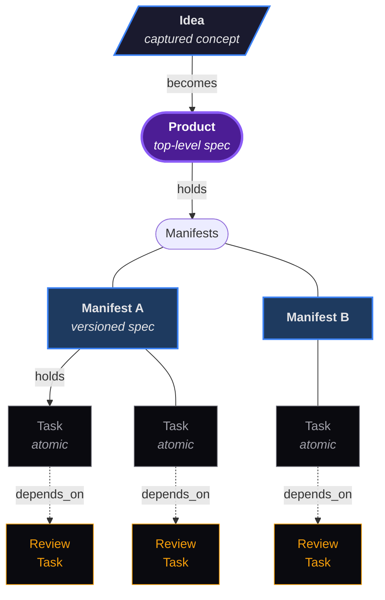
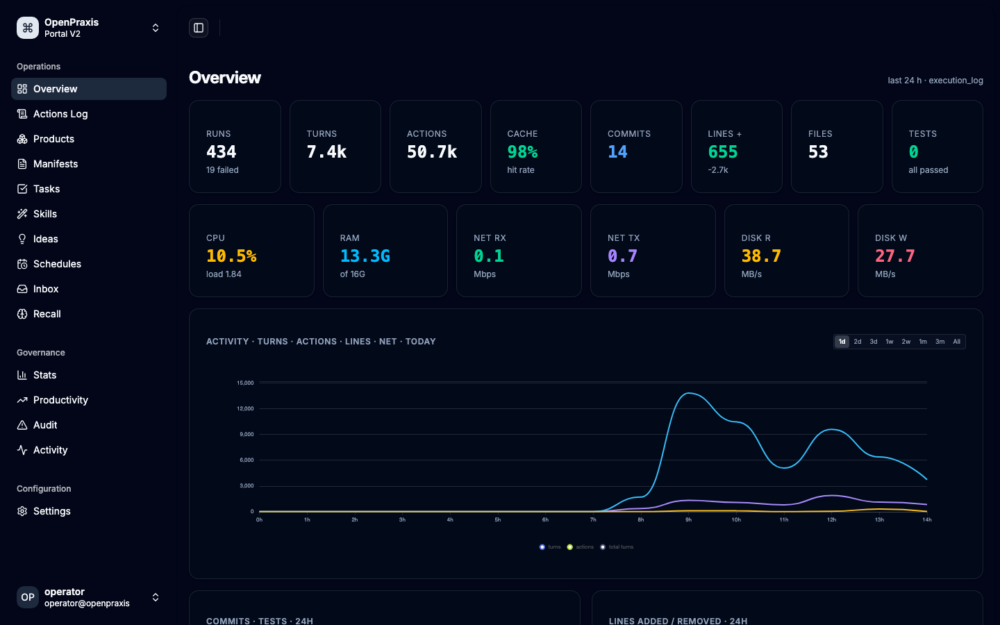
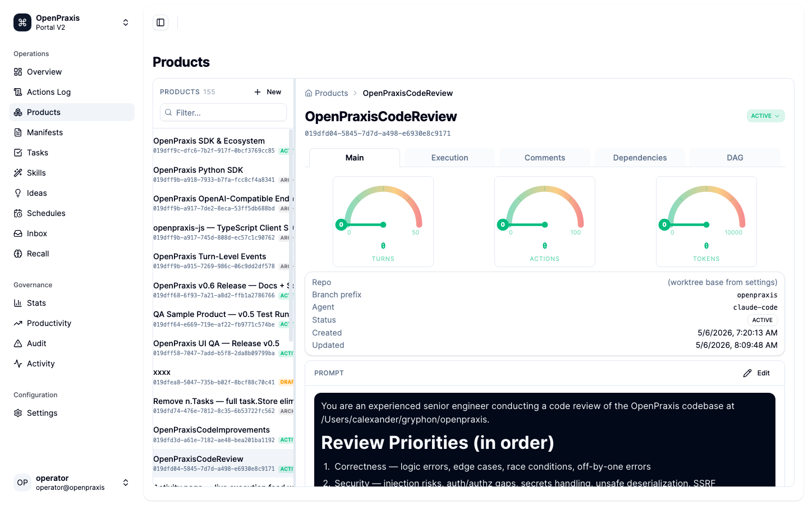
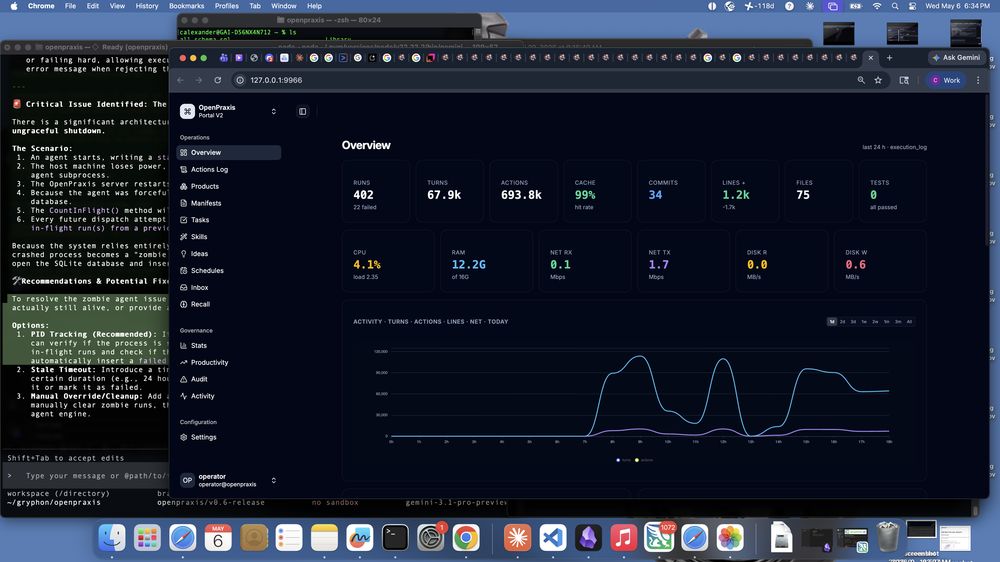
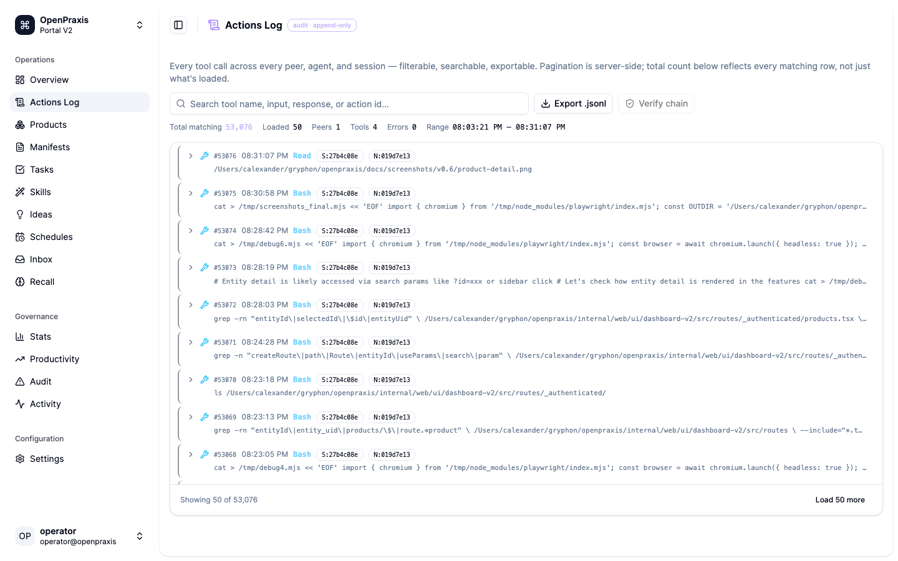
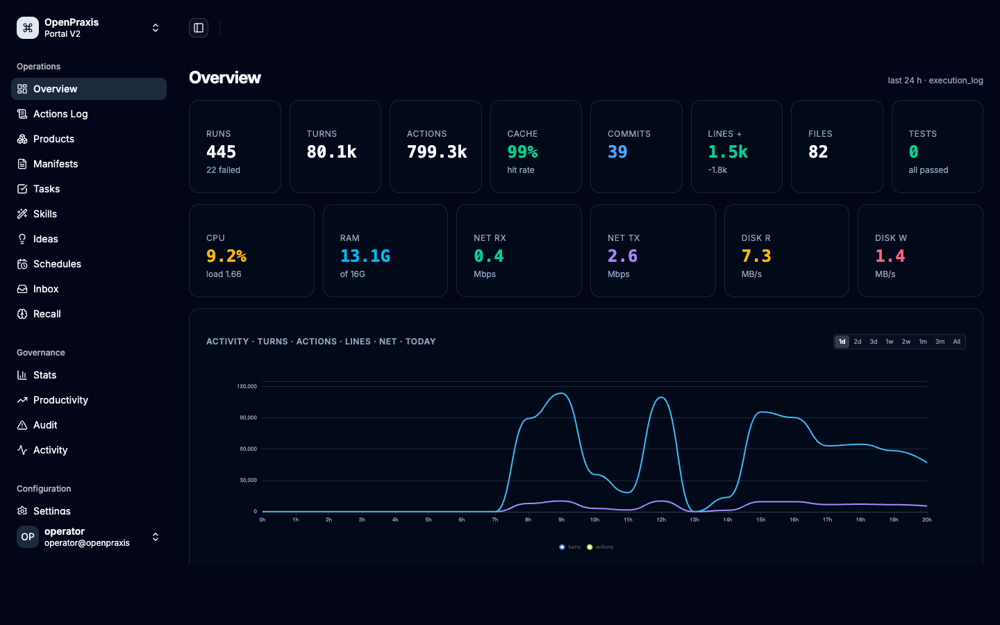

# OpenPraxis

[](https://github.com/k8nstantin/OpenPraxis/actions/workflows/ci.yml)
[](https://github.com/k8nstantin/OpenPraxis/blob/main/go.mod)
[](https://goreportcard.com/report/github.com/k8nstantin/OpenPraxis)
[](https://opensource.org/licenses/Apache-2.0)
[](https://github.com/k8nstantin/OpenPraxis/releases)

### Build products with AI agents — end to end.

**OpenPraxis is a full DAG execution engine for AI-assisted software development.** One captured Idea becomes a Product. A Product holds chained Manifests (versioned specs with deliverables). Each Manifest holds chained Tasks that dispatch agents (Claude Code, Cursor, Codex) in isolated git worktrees. Every action is captured, every completed Task is audited independently of the agent, every cost unit attributes back to the spec that drove it — on a single graph, visualised, searchable, self-hosted.



**Progression:** *Idea* → *Product* → *Manifest* → *Task (atomic)* → *Review Task*. Idea at the top — the captured concept. Product beneath it as the spec root. Manifests hang off the Product as independent specs — they do **not** depend on each other by default; each Manifest is its own fireable unit. Tasks hang off each Manifest as grapes — the Task is the **atomic unit of work** that dispatches one agent in one worktree. Each Task pairs with its own Review Task, chained via `depends_on`: when the parent Task completes, the Review Task auto-activates, inspects the real-world side effects, and posts `review_approval` or `review_rejection` on the parent. The watcher's gate findings surface as comments; the Review Task owns the verdict.

*(Manifest-to-manifest and product-to-product `depends_on` dependencies are supported in the model — see [Workflow Engine reference](docs/workflow-engine.md) — but the primary pattern keeps Manifests independent. Complex cross-manifest coordination becomes useful as agents mature.)*

**Cost control, independent quality audit, cross-agent comparison, and forecasting are outcomes of the engine** — not separate tools bolted on.

<p align="center">
  
</p>

<p align="center">
  
  
</p>

### Features

- **Trace-grounded feedback loop.** *(v0.9)* Every retry sees what the previous run attempted — prior execution digests and agent review comments injected into the prompt automatically. Agents stop repeating the same mistakes. Pass rates per task queryable via API. An autonomous proposer loop evolves the prompt scaffold when tasks plateau. [Full guide →](docs/trace-grounded-feedback.md)
- **End-to-end product build graph.** One Product, many independent Manifests (fire each on its own), many Tasks per Manifest with paired Review Tasks chained via `depends_on`. The graph plans, dispatches, audits, and costs every step from initiative spec to merged commit. IDE agents, orchestration SDKs, and observability proxies each cover a slice; OpenPraxis owns the whole chain. [Detailed comparison →](docs/compared-to-ai-agent-tools.md)
- **Line-item cost attribution.** Every cost unit spent attributed to a task, a spec, a product, a day, and the authorizing policy.
- **Pre-fire cost forecasting.** Predict what the next run, manifest, or sprint will cost from your actual history, per model, per agent, per spec shape.
- **Independent quality audit.** Every completed task audited against spec, build, and diff by a separate watcher; paired review tasks post the final verdict.
- **Cross-agent efficiency comparison.** Claude Code vs Cursor vs Codex measured on your real code — cost per approved task, review-approval rate, diff cleanliness.
- **End-to-end audit trail.** Every action, decision, and verdict persists with full provenance for compliance, postmortems, and root-cause analysis.
- **Team-wide shared memory.** Specs, memories, decisions, and rules sync across every engineer's machine over the local network — no SaaS lock-in.
- **Central governance.** Daily budgets, per-task caps, approval rules, and scope boundaries enforced by the platform; engineers keep shipping.
- **Atomic-granularity observability.** Drill from a product's total spend to the exact tool call that caused it in two clicks.
- **Interactive build DAG.** The whole plan as a clickable, status-colored graph — brief a stakeholder without a deck.
- **Self-hosted, offline-capable.** Control plane runs on your hardware; we're not in your data path.
- **→ [How is OpenPraxis different from other AI-agent tools?](docs/compared-to-ai-agent-tools.md)** Full landscape map vs IDE agent runtimes (Cline, Cursor, OpenHands, Goose), orchestration SDKs (CrewAI, LangChain), observability proxies (Helicone, Langfuse, AgentOps), enterprise platforms (watsonx, UiPath), and closest concept match (Paperclip). Plus [OpenClaw comparison ↓](#where-openpraxis-fits) for the consumer-assistant axis.

### How it fits


Developers write the spec. Leadership sets the budget, caps, and rules. OpenPraxis dispatches the work to whichever agent is best for the job, captures every action the agent takes, audits the result independently of the agent, attributes the spend to the originating spec, and syncs the memory across the team — all on your hardware, on your terms.

## The Hierarchy — Product → Manifest → Task

**One organizational model, used everywhere.** OpenPraxis orchestrates work as a three-level hierarchy borrowed from how actual engineering teams already think. Everything — cost, turns, status, settings, review verdicts — cascades up or down this spine.

```
 Peer  (your machine, identified by UUID v7 + MAC fingerprint)
   │
   ├──  Idea               [CAPTURED CONCEPT — upstream of any build work]
   │      │                  priority (low/medium/high/critical) · tags
   │      │                  link_idea_manifest ties ideas to the specs they spawned
   │      │
   ├──  Product            [SPEC — top level, groups manifests under one umbrella]
   │      │                  title · tags · status · cost rollup · DAG root
   │      │
   │      ├──  Manifest    [SPEC — versioned markdown with deliverables]
   │      │      │           depends_on other manifests (build order)
   │      │      │           jira_refs · status · linked ideas · comments
   │      │      │
   │      │      ├──  Task [ATOMIC UNIT OF WORK — executes one agent]
   │      │      │     │    depends_on other tasks · schedule (once / 5m / at:)
   │      │      │     │    status, cost, turns, run_count, branch · comments
   │      │      │     │
   │      │      │     ├──  Run     [ATOMIC UNIT OF EXECUTION — one attempt]
   │      │      │     │     │         started_at / completed_at · cost · exit code
   │      │      │     │     │
   │      │      │     │     └──  Action  [ATOMIC UNIT OF MEASUREMENT — one tool call]
   │      │      │     │                    tool_name · tool_input · tool_response · cwd
   │      │      │
   │      │      └──  Review Task [ATOMIC UNIT OF VERDICT — paired via depends_on]
   │      │            auto-activates on parent completion
   │      │            posts review_approval / review_rejection on parent
   │      │
   │      └──  More manifests … chained by manifest depends_on
   │
   └──  More products …
```

**The taxonomy at a glance:**

| Level | What it is | Atomic? |
|---|---|---|
| **Idea** | Captured concept — priority + tags. Upstream of any build work; links to the Manifests it spawned. | No (seed) |
| **Product** | Top-level spec — groups related manifests under one umbrella | No (container) |
| **Manifest** | Versioned detailed spec with deliverables, depends_on, status | No (container) |
| **Task** | Scheduled unit of work that dispatches one agent session | **Atomic unit of work** |
| **Run** | One execution attempt of a task | **Atomic unit of execution** |
| **Action** | One tool call made by the agent during a run | **Atomic unit of measurement** |
| **Review Task** | A `depends_on`-paired Task that audits its parent's output | **Atomic unit of verdict** |

### Why a hierarchy

- **Organization matches reality.** Initiatives have specs. Specs have work items. Work items have runs. Runs have tool calls. The model holds all the way down.
- **Aggregation is free.** Cost and turns roll up at every level with no manual bookkeeping — drill from _"the product cost X"_ → _"this manifest accounted for most of it"_ → _"this one task spent the bulk"_ → _"this one agent turn burned the peak"_ → _"here's the exact prompt and tool call that caused it"._
- **Settings cascade.** 12 execution knobs resolve via `task → manifest → product → system`. Set `max_turns=100` once at the product, every task under it inherits. Override for one hard manifest. Override again for one risky task. The resolver walks the chain on every read.
- **Dependencies at every layer.** Products depend on products. Manifests depend on manifests (build order). Tasks depend on tasks (run order + paired reviews). The same `depends_on` primitive powers all three — and the scheduler blocks dependents until prerequisites are terminal.
- **Reviews ride the same chain.** The review-task pattern pairs every main task with a verify task via `depends_on`; when main completes, review auto-activates, polls real-world state, and posts the canonical verdict. No watcher can override it; no review agent can impersonate the watcher.

## The DAG — your shop floor, at a glance

**The hierarchy isn't just a data model — it's a picture.** Every product renders as an interactive Directed Acyclic Graph. You see the whole build plan at once: what's done, what's running, what's blocked, what's next, where the money went, and exactly which task implements which line of which spec.

<p align="center">
  
</p>

- **Purple product node** at the top — the initiative.
- **Manifest nodes** linked by blue manifest-dep edges — the build order.
- **Task nodes** under each manifest linked by yellow task-dep edges — the execution chain.
- **Ownership edges** (dashed) from manifest to each root task — the "I belong to this spec" relationship.
- **Status colours** — green done, grey pending, red failed, amber in flight. One glance tells you where the build is.
- **Any shape, no custom code.** Linear 12-task chain (like the ELS product: `T1 → T1R → T2 → T2R → … → T6R`)? Renders top-to-bottom. Eight independent pairs (like INT MySQL backup/verify)? Renders as eight parallel short columns. Multi-parent fan-in? Dagre figures it out. Empty manifest? Graceful. The renderer takes the edge set and delegates layout to [dagre](https://github.com/dagrejs/dagre) ([PR #158](https://github.com/k8nstantin/OpenPraxis/pull/158)); we don't do arithmetic on positions anymore.
- **Click any node to drill in.** Purple → product detail. Blue → manifest detail. Chain node → task detail with live output. `#view-products/<id>/dag` is shareable.
- **Contract-tested at the API level.** `TestProductHierarchy_EmptyProduct / _LinearChain / _ParallelPairs` locks the `/api/products/:id/hierarchy` payload the renderer rides on so a new DAG shape can't silently break the layout ([PR #160](https://github.com/k8nstantin/OpenPraxis/pull/160)).

**Why it matters.** A spec without a picture is a PDF nobody reads. A DAG without real numbers is a toy. OpenPraxis combines both — you see the plan _and_ the current cost, status, run count, and cost-per-turn of every node in it, live, in one view.

## Table of contents

- [Features](#features) · [How it fits](#how-it-fits) · [The Hierarchy](#the-hierarchy--product--manifest--task) · [The DAG](#the-dag--your-shop-floor-at-a-glance) · [Where OpenPraxis fits (vs OpenClaw)](#where-openpraxis-fits)
- [See it in action](#see-it-in-action)
  - [Dashboard — cost today vs. budget, tasks ranked by spend](#dashboard--cost-today-vs-budget-tasks-ranked-by-spend)
  - [Live tool output — watch the agent work, turn by turn](#live-tool-output--watch-the-agent-work-turn-by-turn)
  - [Products → Manifests → Tasks — every cost and every turn rolls up](#products--manifests--tasks--every-cost-and-every-turn-rolls-up)
  - [Visualize the plan — interactive DAG, status-colored](#visualize-the-plan--interactive-dag-status-colored)
  - [Every conversation, every tool call, every visceral-rule ack — searchable forever](#every-conversation-every-tool-call-every-visceral-rule-ack--searchable-forever)
  - [Independent evaluation — three gates an agent can't override](#independent-evaluation--three-gates-an-agent-cant-override)
  - [Hierarchical execution controls — budgets, turns, and agent knobs that inherit](#hierarchical-execution-controls--budgets-turns-and-agent-knobs-that-inherit)
- [How It Works](#how-it-works)
  - [The Workflow](#the-workflow)
- [Architecture](#architecture)
- [Key Concepts](#key-concepts)
  - [Products](#products) · [Manifests (Specs)](#manifests-specs) · [Tasks (Autonomous Execution)](#tasks-autonomous-execution) · [Watcher (Independent Auditor)](#watcher-independent-auditor)
  - [Ideas](#ideas) · [Memories](#memories) · [Visceral Rules](#visceral-rules) · [Conversations](#conversations) · [Chat](#chat)
- [Dashboard (17 Tabs)](#dashboard-17-tabs)
- [MCP Tools (55 as of 2026-04-22)](#mcp-tools-55-as-of-2026-04-22)
- [Quick Start](#quick-start)
  - [Prerequisites](#prerequisites) · [Build and Run](#build-and-run) · [Connect to Claude Code](#connect-to-claude-code) · [Dashboard](#dashboard)
- [Stats](#stats)
- [Database](#database)
- [Project Structure](#project-structure)
- [Hooks](#hooks)
- [Peer Sync](#peer-sync)
- [Configuration](#configuration)
- [Mobile App](#mobile-app)
- [License](#license)

**Deeper references:**
- [Compared to other AI-agent tools — full landscape map](docs/compared-to-ai-agent-tools.md) — IDE runtimes, orchestration SDKs, observability proxies, enterprise platforms, and Paperclip
- [Execution Controls — all 12 knobs in detail](docs/execution-controls.md)
- [Workflow Engine — DAG, states, activation model, review loop, SCD principle](docs/workflow-engine.md)
- [Changelog — April 2026 release notes](docs/changelog.md)

## Where OpenPraxis fits

**If an AI model is a CNC machine, OpenPraxis is the factory.** The model cuts metal; OpenPraxis is everything around it: the specs (manifests), the work orders (tasks), the shop floor (execution engine), the time clock (cost + turn tracking), the QA station (watcher), the archive (memory), and the shift log (activity feed). One developer with OpenPraxis runs an engineering shop, not a chat thread.

**Professional AI development tool — not a consumer agent-message manager.** OpenPraxis lives on the builder's side of the tool: every action an agent takes is captured, every cost unit is attributed, every rule is enforceable, every decision is auditable months later. It is purpose-built for the person who has to track the cost of every agent run, defend the merges, and find out what the agent actually did on Tuesday.

OpenPraxis is not a consumer chat wrapper. If you are looking to route inbound WhatsApp / iMessage / Telegram messages to a local assistant, OpenPraxis isn't the tool — [OpenClaw](https://github.com/openclaw/openclaw) or a similar assistant gateway is. OpenPraxis starts where the build request starts and ends where the commit lands.

| | OpenPraxis | Consumer agent-message managers (e.g. OpenClaw) |
|---|---|---|
| **Domain** | AI-assisted software development | Local personal assistant over chat/voice |
| **Front door** | Manifests + scheduled tasks written by a developer | Inbound messages on WhatsApp, iMessage, Telegram, Signal, Slack, Discord, ... |
| **Output** | Commits, branches, PRs, dashboard state | Reply messages in the source channel + voice + canvas |
| **Unit of work** | A task that runs an agent session against a spec | A conversation turn in a messaging thread |
| **Isolation** | One agent per task, in its own git worktree | One agent per channel / account / workspace |
| **Cost model** | Per-task, per-turn, per-day, per-product spend — first-class metric | Not a first-class surface |
| **Audit model** | Independent watcher + typed review comments + execution_review retrospectives | Conversation history |
| **Ideal user** | Professional developer / team with AI spend to justify and merges to defend | Power user who wants a private assistant across their chat apps |
| **Persistence** | Embedded local store with semantic + keyword search | JSON config + workspace dirs |
| **Primary language** | Go (single binary) | TypeScript / Node.js |

Short version: **OpenPraxis captures what the agent did and what it cost, every turn, forever.** That's the core. Everything else — specs, review workflows, peer sync, the DAG viewer — is in service of that capture loop.

## See it in action

Most agent tools hand you a black box: you push "run", hope for the best, and reconstruct what happened from a log scroll. OpenPraxis inverts that. **Every turn, every tool call, every commit, every dollar — captured as it happens, aggregated upward, and surfaced on a single dashboard.** Cost is a first-class metric on the task, the manifest, the product, and the day. Activity is a first-class record: every prompt, every tool input, every tool result, every acknowledgement of a visceral rule. Independent evaluation is non-negotiable: the watcher audits every completed task and posts findings the agent cannot delete.

The result is cost and quality control by construction — you set a daily budget, you see spend accrue against it live, the watcher flags every failed gate, and runaway sessions can't hide behind a finished status.

### Dashboard — cumulative cost, cache efficiency, and live activity

<p align="center">
  
</p>

One glance tells you the entire cost and efficiency story of your fleet:

- **AI Stats (cumulative)** — total cost, turns, actions, and runs across all time (or scoped to today). Trend charts for cost, turns, and actions show where spend accelerated.
- **Cache hit ratio** — dial gauge. 98% means almost every token was served from cache; a drop here is the earliest signal that prompts drifted and cost is about to spike.
- **Token split** — stacked bar: `cache_read` (green) vs `input` (blue) vs `cache_create` (orange) vs `output` (yellow). Lets you see exactly how token budget is allocated across the fleet.
- **Actions / hour** — 12-hour histogram. Identify burst windows, overnight runs, and idle periods at a glance.
- **Top tools** — ranked by call count across the last 300 actions. Know whether your agents spend time in `Bash`, `Read`, `Edit`, or MCP calls.
- **Nodes & Sessions** — peer roster with live session cards: which agents are connected, turn count, last activity.

### Live tool output — watch the agent work, turn by turn

<p align="center">
  
</p>

Open any task and see everything in one panel:

- **Execution control dials** — semicircle gauges for max turns, max cost, temperature, reasoning effort, and more. Set them per-task; they inherit from manifest → product → system when not overridden.
- **Dependency chain** — which tasks this one depends on, and which depend on it.
- **Run history** — every execution attempt with start time, cost, turns, exit reason, and status. Click any run to drill into its action log.
- **Live output** — bash commands, file reads, edits, and MCP calls stream in turn-by-turn as the agent runs.
- **Pause (SIGSTOP) / Stop / Emergency Stop All** — freeze or kill from the task header; no waiting for the agent.
- **Comments thread** — typed comments (`agent_note`, `review_approval`, `watcher_finding`, etc.) on the same page as the run output.

### Products → Manifests → Tasks — every execution rolls up

<table>
  <tr>
    <td width="50%"></td>
    <td width="50%"></td>
  </tr>
  <tr>
    <td align="center"><sub><b>Products</b> group manifests under one initiative. Unified entity model (v0.6): all types in one <code>entities</code> table with SCD-2 history.</sub></td>
    <td align="center"><sub><b>Manifests</b> are specs driving task execution. Every entity type now uses the same prompt/comment model — the latest <code>prompt</code> comment is the active spec.</sub></td>
  </tr>
</table>

Hierarchy: **Product → Manifest → Task → Run → Action**. Costs and turns aggregate at every level. Drill from _"the product cost X"_ → _"this manifest accounted for most of it"_ → _"this one task spent the bulk"_ → _"this one agent turn burned the peak"_ → _"here's the exact prompt and tool call."_

### Visualize the plan — interactive DAG, status-colored

<p align="center">
  
</p>

Every product renders as an interactive directed acyclic graph:

- **Product node** at the top — the initiative root.
- **Manifest nodes** linked by manifest-dep edges — the build order.
- **Task nodes** under each manifest linked by task-dep edges — the execution chain.
- **Status colors** — green done, gray pending, red failed, amber in flight.
- **Zoom, pan, click to drill.** Click any node to open its detail panel inline.

### Every action, every session — searchable forever

<p align="center">
  
</p>

Every agent session is captured as a conversation:

- **Every turn** — prompt, response, tool call, tool result, thinking block.
- **Visceral-rule acknowledgements** — an agent that skips the `visceral_rules` → `visceral_confirm` handshake is flagged as **amnesia** on the dashboard (look at the badge in the nav — 10000 violations shown here).
- **Semantic search** — 768-dim embeddings via Ollama. "Find the session where we fixed the sqlite busy_timeout bug" is a similarity query, not a filename search.
- **Per-peer, per-session grouping** — every conversation is tagged with the peer that ran it, so multi-machine teams get one unified history.

### Independent observer — three gates whose findings post as comments

<p align="center">
  
</p>

The watcher is a **separate process** outside every agent session. After a task finishes, it runs three gates:

1. **Git gate** — did the agent produce commits on the task branch? (Zero commits = observation flagged.)
2. **Build gate** — does the code compile? (`go build ./...` here; configurable per language.)
3. **Manifest gate** — were the deliverables addressed? (Parses the manifest markdown into a checklist, scores how many items were actually touched in the diff.)

**As of 2026-04-22 the watcher is observer-only** (PR #149). Gate outcomes persist as `watcher_audits` rows and auto-post a `watcher_finding` comment on the task. The watcher **does not mutate task status** and **does not block downstream activation** — the paired review task (if any) is the sole decision point for the verdict.

Why the shift: ops-style tasks (SSH-dispatch, fire-and-forget infrastructure jobs) legitimately produce zero commits, and the earlier "zero commits = instant fail" behaviour kept downgrading those to `failed` and blocking their chained verify task. The three gates are still valuable **signals** — they still surface in the UI and in the audit history — but verdicts belong to the review task, which can see the live state on the remote target.

The review task pattern: pair every main task with a `depends_on`-linked review task that auto-activates on completion, polls the real-world side effects, and posts `review_approval` or `review_rejection` as the canonical verdict.

### Hierarchical execution controls — budgets, turns, and agent knobs that inherit

<table>
  <tr>
    <td width="50%"></td>
    <td width="50%"></td>
  </tr>
  <tr>
    <td align="center"><sub><b>Settings</b> — global config with provider integrations</sub></td>
    <td align="center"><sub><b>Task</b> — execution knobs with inheritance from manifest → product → system</sub></td>
  </tr>
</table>

Twelve execution knobs — `max_parallel`, `max_turns`, `max_cost_usd`, `daily_budget_usd`, `timeout_minutes`, `temperature`, `reasoning_effort`, `default_agent`, `default_model`, `retry_on_failure`, `approval_mode`, `allowed_tools` — configurable at **four scopes with inheritance**: **task → manifest → product → system**. Set a product-wide budget once; every task under it inherits. Override one manifest's `max_turns` for a hard job; the product default still covers the rest.

- **Inline provenance** — every knob shows where the value came from ("inherited from product X") so you know which scope to edit to change it everywhere vs. here.
- **Reset to inherited** — one click drops a local override, reverts to the scope above.
- **Soft-cap warnings** — push `daily_budget_usd` above the visceral rule's hard cap and the UI warns before save; the runner clamps at runtime regardless.
- **Debounced save** — slide the value, it saves 300 ms after you stop; no "Apply" button to forget.
- **Agent-readable** — the MCP `settings_resolve` tool returns the effective value walking the inheritance chain, so agents query the budget instead of guessing.

Storage: a single `settings` table with `(scope_type, scope_id, key)` primary key. The resolver walks task → linked manifests → product → system on every read, clamped by visceral rules. Nine HTTP endpoints (`/api/settings/...`) mirror the four MCP tools for dashboard use.

📖 **[Full reference: all 12 knobs, types, ranges, and enforcement](docs/execution-controls.md)** — what each knob does, how the runner uses it, and which scope typically owns it.

## How It Works

```
You have an idea
     |
     v
  [Idea] -----> [Manifest] -----> [Task] -----> [Agent Session]
  capture it     write the spec    schedule it    autonomous execution
     |                |                |                |
     v                v                v                v
  [Product]      [Dependencies]   [Dependency      [Watcher]
  group specs    chain manifests   chain tasks]     audit: git, build,
  track cost     set build order   sequential       manifest compliance
                                   execution        agent can't self-grade
```

### The Evolutionary Loop (The Process)

4. **Natural Selection:** The agent (or human) calls `kf integrate`. The system subjects the Mutation to the environment (the test suite).
5. **Evolution:** If the Mutation survives (tests pass), it is woven into the Organism. If it fails, the mutation is discarded or refined.
6. **Osmosis:(* The new DNA is instantly shared via Osmosis with all other peers in the Dojo.

1. **Mutate:** An agent (or human) starts a new task. KungFu creates a Mutation (an isolated CRDT filter).
2. **Expression:** The agent performs surgical Splice operations. These are recorded as DNA segments.
3. **Transcription:** KungFu continuously Transcribes the mutation to the local disk so the agent can run tests.### The Evolutionary Loop

1. **Mutate:** An agent (or human) starts a new task. KungFu creates a Mutation (an isolated CRDT filter).
2. **Expression:** The agent performs surgical Splice operations. These are recorded as DNA segments.
3. **Transcription:** KungFu continuously Transcribes the mutation to the local disk so the agent can run tests.
4. **Natural Selection:** The agent (or human) calls `kf integrate`. The system subjects the Mutation to the environment (the test suite).
5. **Evolution:** If the Mutation survives (tests pass), it is woven into the Organism. If it fails, the mutation is discarded or refined.
6. **Osmosis:** The new DNA is instantly shared via Osmosis with all other peers in the Dojo.

---
*KungFu is a standalone research project designed to power autonomous engineering at scale.*