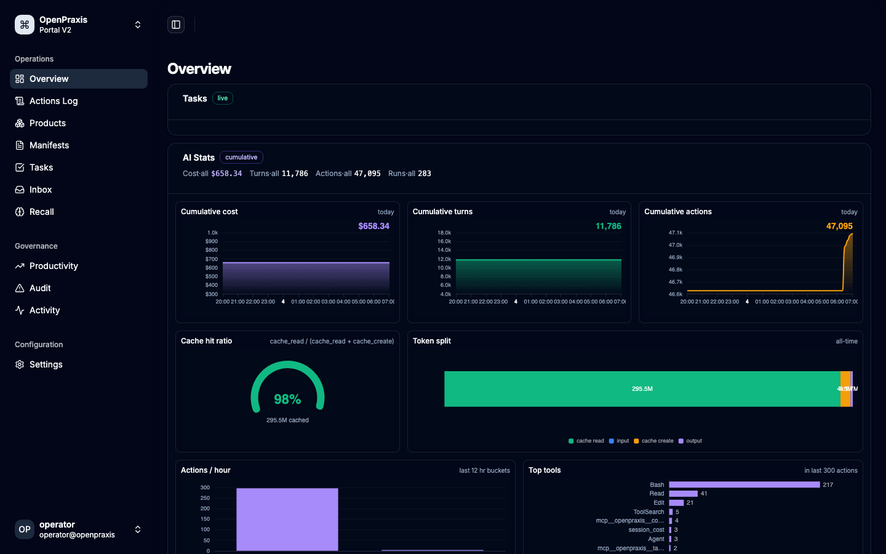
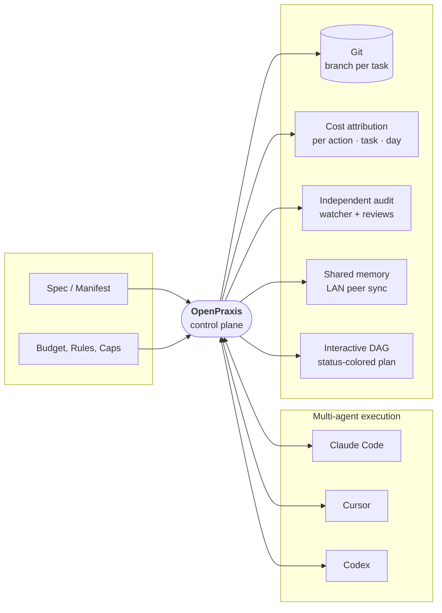
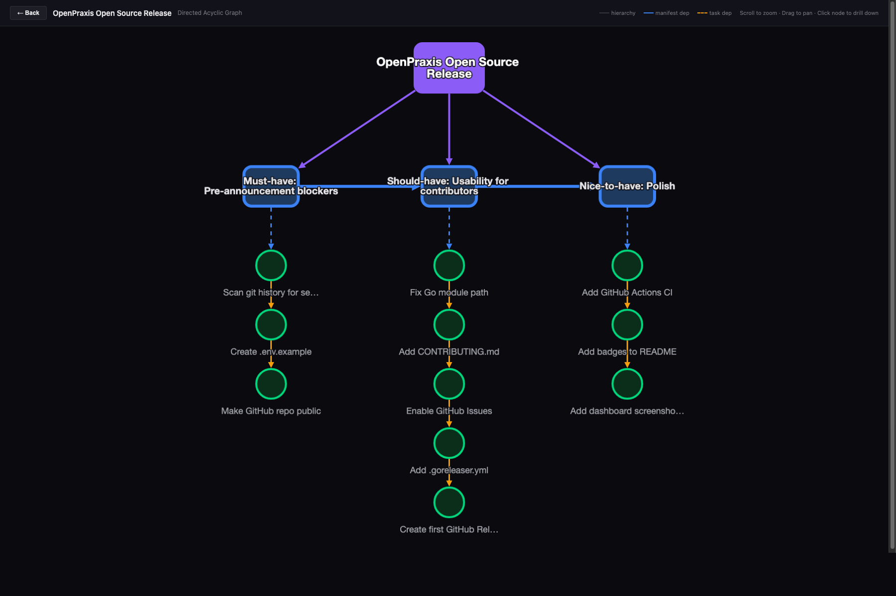
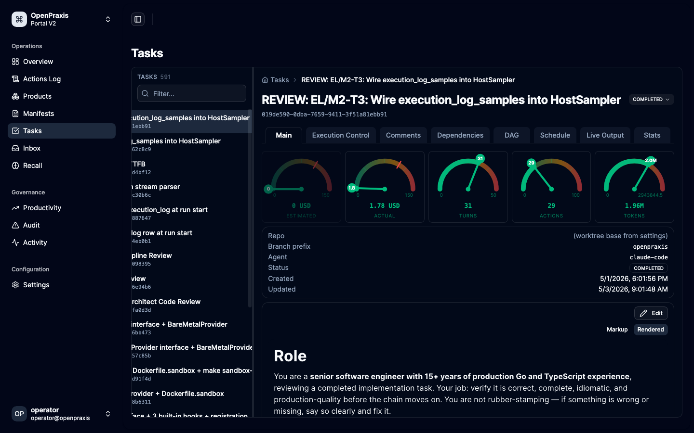
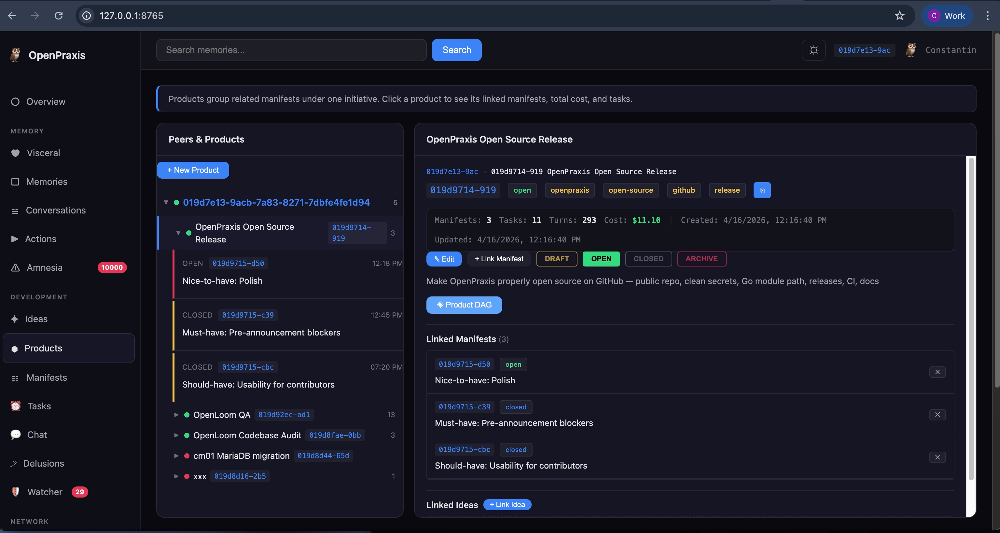
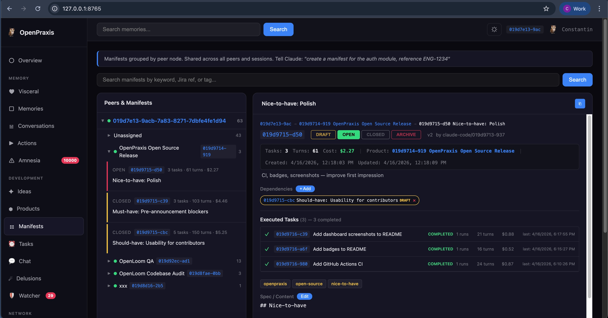
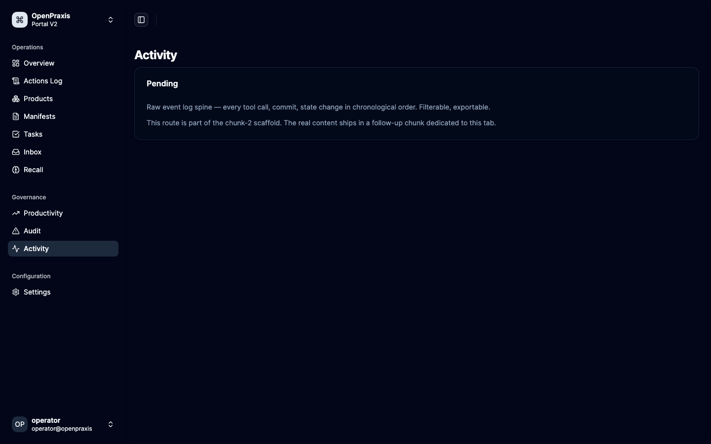
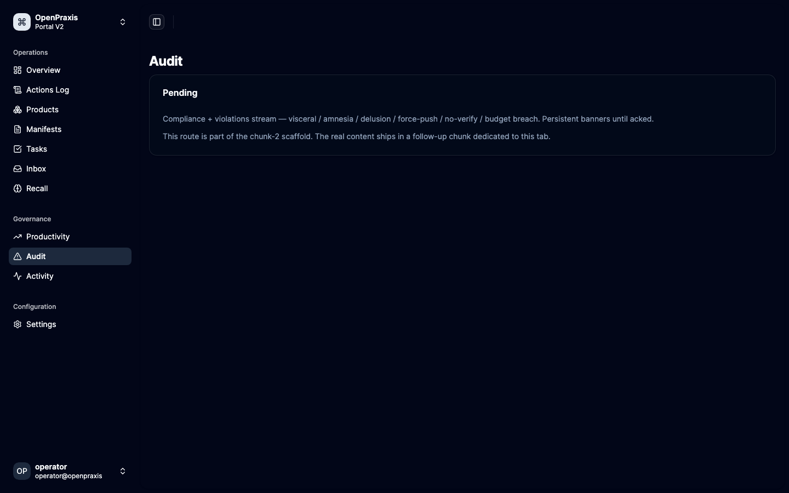
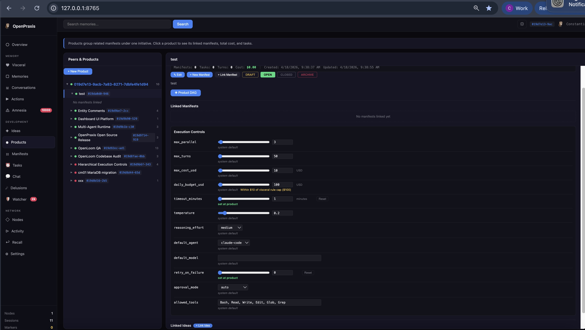
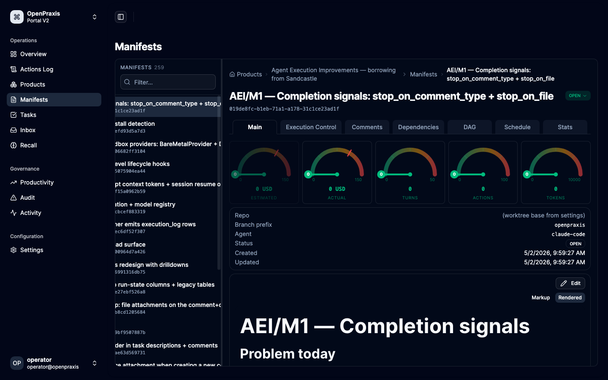

# OpenPraxis

[](https://github.com/k8nstantin/OpenPraxis/actions/workflows/ci.yml)
[](https://github.com/k8nstantin/OpenPraxis/blob/main/go.mod)
[](https://goreportcard.com/report/github.com/k8nstantin/OpenPraxis)
[](https://opensource.org/licenses/Apache-2.0)
[](https://github.com/k8nstantin/OpenPraxis/releases)

### Build products with AI agents — end to end.

**OpenPraxis is a full DAG execution engine for AI-assisted software development.** One initiative becomes a Product. A Product holds chained Manifests (versioned specs with deliverables). Each Manifest holds chained Tasks that dispatch agents (Claude Code, Cursor, Codex) in isolated git worktrees. Every action is captured, every completed Task is audited independently of the agent, every cost unit attributes back to the spec that drove it — on a single graph, visualised, searchable, self-hosted.

**Cost control, independent quality audit, cross-agent comparison, and forecasting are outcomes of the engine** — not separate tools bolted on.

<p align="center">
  
</p>

### Features

- **End-to-end product build graph.** One Product, many chained Manifests (build-order dependencies), many chained Tasks per Manifest (execution-order + paired reviews). The graph plans, dispatches, audits, and costs every step from initiative spec to merged commit. IDE agents, orchestration SDKs, and observability proxies each cover a slice; OpenPraxis owns the whole chain. [Detailed comparison →](docs/compared-to-ai-agent-tools.md)
- **Line-item cost attribution.** Every cost unit spent attributed to a task, a spec, a product, a day, and the authorizing policy.
- **Pre-fire cost forecasting.** Predict what the next run, manifest, or sprint will cost from your actual history, per model, per agent, per spec shape.
- **Independent quality audit.** Every completed task audited against spec, build, and diff by a separate watcher; paired review tasks post the final verdict.
- **Cross-agent efficiency comparison.** Claude Code vs Cursor vs Codex measured on your real code — cost per approved task, review-approval rate, diff cleanliness.
- **End-to-end audit trail.** Every action, decision, and verdict persists with full provenance for compliance, postmortems, and root-cause analysis.
- **Team-wide shared memory.** Specs, memories, decisions, and rules sync across every engineer's machine over the local network — no SaaS lock-in.
- **Central governance.** Daily budgets, per-task caps, approval rules, and scope boundaries enforced by the platform; engineers keep shipping.
- **Atomic-granularity observability.** Drill from a product's total spend to the exact tool call that caused it in two clicks.
- **Interactive build DAG.** The whole plan as a clickable, status-colored graph — brief a stakeholder without a deck.
- **Self-hosted, offline-capable.** Control plane runs on your hardware; we're not in your data path.
- **→ [How is OpenPraxis different from other AI-agent tools?](docs/compared-to-ai-agent-tools.md)** Full landscape map vs IDE agent runtimes (Cline, Cursor, OpenHands, Goose), orchestration SDKs (CrewAI, LangChain), observability proxies (Helicone, Langfuse, AgentOps), enterprise platforms (watsonx, UiPath), and closest concept match (Paperclip). Plus [OpenClaw comparison ↓](#where-openpraxis-fits) for the consumer-assistant axis.

### How it fits



Developers write the spec. Leadership sets the budget, caps, and rules. OpenPraxis dispatches the work to whichever agent is best for the job, captures every action the agent takes, audits the result independently of the agent, attributes the spend to the originating spec, and syncs the memory across the team — all on your hardware, on your terms.

## The Hierarchy — Product → Manifest → Task

**One organizational model, used everywhere.** OpenPraxis orchestrates work as a three-level hierarchy borrowed from how actual engineering teams already think. Everything — cost, turns, status, settings, review verdicts — cascades up or down this spine.

```
 Peer  (your machine, identified by UUID v7 + MAC fingerprint)
   │
   ├──  Product            [SPEC — initiative level]
   │      │                  title · tags · status · cost rollup · DAG root
   │      │
   │      ├──  Manifest    [SPEC — versioned markdown with deliverables]
   │      │      │           depends_on other manifests (build order)
   │      │      │           jira_refs · status · linked ideas · comments
   │      │      │
   │      │      ├──  Task [ATOMIC UNIT OF WORK — executes one agent]
   │      │      │     │    depends_on other tasks · schedule (once / 5m / at:)
   │      │      │     │    status, cost, turns, run_count, branch · comments
   │      │      │     │
   │      │      │     ├──  Run     [ATOMIC UNIT OF EXECUTION — one attempt]
   │      │      │     │     │         started_at / completed_at · cost · exit code
   │      │      │     │     │
   │      │      │     │     └──  Action  [ATOMIC UNIT OF MEASUREMENT — one tool call]
   │      │      │     │                    tool_name · tool_input · tool_response · cwd
   │      │      │
   │      │      └──  Review Task [ATOMIC UNIT OF VERDICT — paired via depends_on]
   │      │            auto-activates on parent completion
   │      │            posts review_approval / review_rejection on parent
   │      │
   │      └──  More manifests … chained by manifest depends_on
   │
   └──  More products …
```

**The taxonomy at a glance:**

| Level | What it is | Atomic? |
|---|---|---|
| **Product** | Initiative-level spec — the "what we're building" | No (container) |
| **Manifest** | Versioned detailed spec with deliverables, depends_on, status | No (container) |
| **Task** | Scheduled unit of work that dispatches one agent session | **Atomic unit of work** |
| **Run** | One execution attempt of a task | **Atomic unit of execution** |
| **Action** | One tool call made by the agent during a run | **Atomic unit of measurement** |
| **Review Task** | A `depends_on`-paired Task that audits its parent's output | **Atomic unit of verdict** |

### Why a hierarchy

- **Organization matches reality.** Initiatives have specs. Specs have work items. Work items have runs. Runs have tool calls. The model holds all the way down.
- **Aggregation is free.** Cost and turns roll up at every level with no manual bookkeeping — drill from _"the product cost X"_ → _"this manifest accounted for most of it"_ → _"this one task spent the bulk"_ → _"this one agent turn burned the peak"_ → _"here's the exact prompt and tool call that caused it"._
- **Settings cascade.** 12 execution knobs resolve via `task → manifest → product → system`. Set `max_turns=100` once at the product, every task under it inherits. Override for one hard manifest. Override again for one risky task. The resolver walks the chain on every read.
- **Dependencies at every layer.** Products depend on products. Manifests depend on manifests (build order). Tasks depend on tasks (run order + paired reviews). The same `depends_on` primitive powers all three — and the scheduler blocks dependents until prerequisites are terminal.
- **Reviews ride the same chain.** The review-task pattern pairs every main task with a verify task via `depends_on`; when main completes, review auto-activates, polls real-world state, and posts the canonical verdict. No watcher can override it; no review agent can impersonate the watcher.

## The DAG — your shop floor, at a glance

**The hierarchy isn't just a data model — it's a picture.** Every product renders as an interactive Directed Acyclic Graph. You see the whole build plan at once: what's done, what's running, what's blocked, what's next, where the money went, and exactly which task implements which line of which spec.

<p align="center">
  
</p>

- **Purple product node** at the top — the initiative.
- **Manifest nodes** linked by blue manifest-dep edges — the build order.
- **Task nodes** under each manifest linked by yellow task-dep edges — the execution chain.
- **Ownership edges** (dashed) from manifest to each root task — the "I belong to this spec" relationship.
- **Status colours** — green done, grey pending, red failed, amber in flight. One glance tells you where the build is.
- **Any shape, no custom code.** Linear 12-task chain (like the ELS product: `T1 → T1R → T2 → T2R → … → T6R`)? Renders top-to-bottom. Eight independent pairs (like INT MySQL backup/verify)? Renders as eight parallel short columns. Multi-parent fan-in? Dagre figures it out. Empty manifest? Graceful. The renderer takes the edge set and delegates layout to [dagre](https://github.com/dagrejs/dagre) ([PR #158](https://github.com/k8nstantin/OpenPraxis/pull/158)); we don't do arithmetic on positions anymore.
- **Click any node to drill in.** Purple → product detail. Blue → manifest detail. Chain node → task detail with live output. `#view-products/<id>/dag` is shareable.
- **Locally bundled.** Cytoscape + dagre + cytoscape-dagre are served from `/vendor/` on the same Go binary ([PR #159](https://github.com/k8nstantin/OpenPraxis/pull/159)). The DAG works offline, air-gapped, no CDN risk.
- **Contract-tested at the API level.** `TestProductHierarchy_EmptyProduct / _LinearChain / _ParallelPairs` locks the `/api/products/:id/hierarchy` payload dagre rides on so a new DAG shape can't silently break the renderer ([PR #160](https://github.com/k8nstantin/OpenPraxis/pull/160)).

**Why it matters.** A spec without a picture is a PDF nobody reads. A DAG without real numbers is a toy. OpenPraxis combines both — you see the plan _and_ the current cost, status, run count, and cost-per-turn of every node in it, live, in one view.

## Table of contents

- [Features](#features) · [How it fits](#how-it-fits) · [The Hierarchy](#the-hierarchy--product--manifest--task) · [The DAG](#the-dag--your-shop-floor-at-a-glance) · [Where OpenPraxis fits (vs OpenClaw)](#where-openpraxis-fits)
- [See it in action](#see-it-in-action)
  - [Dashboard — cost today vs. budget, tasks ranked by spend](#dashboard--cost-today-vs-budget-tasks-ranked-by-spend)
  - [Live tool output — watch the agent work, turn by turn](#live-tool-output--watch-the-agent-work-turn-by-turn)
  - [Products → Manifests → Tasks — every cost and every turn rolls up](#products--manifests--tasks--every-cost-and-every-turn-rolls-up)
  - [Visualize the plan — interactive DAG, status-colored](#visualize-the-plan--interactive-dag-status-colored)
  - [Every conversation, every tool call, every visceral-rule ack — searchable forever](#every-conversation-every-tool-call-every-visceral-rule-ack--searchable-forever)
  - [Independent evaluation — three gates an agent can't override](#independent-evaluation--three-gates-an-agent-cant-override)
  - [Hierarchical execution controls — budgets, turns, and agent knobs that inherit](#hierarchical-execution-controls--budgets-turns-and-agent-knobs-that-inherit)
- [How It Works](#how-it-works)
  - [The Workflow](#the-workflow)
- [Architecture](#architecture)
- [Key Concepts](#key-concepts)
  - [Products](#products) · [Manifests (Specs)](#manifests-specs) · [Tasks (Autonomous Execution)](#tasks-autonomous-execution) · [Watcher (Independent Auditor)](#watcher-independent-auditor)
  - [Ideas](#ideas) · [Memories](#memories) · [Visceral Rules](#visceral-rules) · [Conversations](#conversations) · [Chat](#chat)
- [Dashboard (17 Tabs)](#dashboard-17-tabs)
- [MCP Tools (55 as of 2026-04-22)](#mcp-tools-55-as-of-2026-04-22)
- [Quick Start](#quick-start)
  - [Prerequisites](#prerequisites) · [Build and Run](#build-and-run) · [Connect to Claude Code](#connect-to-claude-code) · [Dashboard](#dashboard)
- [Stats](#stats)
- [Database](#database)
- [Project Structure](#project-structure)
- [Hooks](#hooks)
- [Peer Sync](#peer-sync)
- [Configuration](#configuration)
- [Mobile App](#mobile-app)
- [License](#license)

**Deeper references:**
- [Compared to other AI-agent tools — full landscape map](docs/compared-to-ai-agent-tools.md) — IDE runtimes, orchestration SDKs, observability proxies, enterprise platforms, and Paperclip
- [Execution Controls — all 12 knobs in detail](docs/execution-controls.md)
- [Workflow Engine — DAG, states, activation model, review loop, SCD principle](docs/workflow-engine.md)
- [Changelog — April 2026 release notes](docs/changelog.md)

## Where OpenPraxis fits

**If an AI model is a CNC machine, OpenPraxis is the factory.** The model cuts metal; OpenPraxis is everything around it: the specs (manifests), the work orders (tasks), the shop floor (execution engine), the time clock (cost + turn tracking), the QA station (watcher), the archive (memory), and the shift log (activity feed). One developer with OpenPraxis runs an engineering shop, not a chat thread.

**Professional AI development tool — not a consumer agent-message manager.** OpenPraxis lives on the builder's side of the tool: every action an agent takes is captured, every cost unit is attributed, every rule is enforceable, every decision is auditable months later. It is purpose-built for the person who has to track the cost of every agent run, defend the merges, and find out what the agent actually did on Tuesday.

OpenPraxis is not a consumer chat wrapper. If you are looking to route inbound WhatsApp / iMessage / Telegram messages to a local assistant, OpenPraxis isn't the tool — [OpenClaw](https://github.com/openclaw/openclaw) or a similar assistant gateway is. OpenPraxis starts where the build request starts and ends where the commit lands.

| | OpenPraxis | Consumer agent-message managers (e.g. OpenClaw) |
|---|---|---|
| **Domain** | AI-assisted software development | Local personal assistant over chat/voice |
| **Front door** | Manifests + scheduled tasks written by a developer | Inbound messages on WhatsApp, iMessage, Telegram, Signal, Slack, Discord, ... |
| **Output** | Commits, branches, PRs, dashboard state | Reply messages in the source channel + voice + canvas |
| **Unit of work** | A task that runs an agent session against a spec | A conversation turn in a messaging thread |
| **Isolation** | One agent per task, in its own git worktree | One agent per channel / account / workspace |
| **Cost model** | Per-task, per-turn, per-day, per-product spend — first-class metric | Not a first-class surface |
| **Audit model** | Independent watcher + typed review comments + execution_review retrospectives | Conversation history |
| **Ideal user** | Professional developer / team with AI spend to justify and merges to defend | Power user who wants a private assistant across their chat apps |
| **Persistence** | Embedded local store with semantic + keyword search | JSON config + workspace dirs |
| **Primary language** | Go (single binary) | TypeScript / Node.js |

Short version: **OpenPraxis captures what the agent did and what it cost, every turn, forever.** That's the core. Everything else — specs, review workflows, peer sync, the DAG viewer — is in service of that capture loop.

## See it in action

Most agent tools hand you a black box: you push "run", hope for the best, and reconstruct what happened from a log scroll. OpenPraxis inverts that. **Every turn, every tool call, every commit, every dollar — captured as it happens, aggregated upward, and surfaced on a single dashboard.** Cost is a first-class metric on the task, the manifest, the product, and the day. Activity is a first-class record: every prompt, every tool input, every tool result, every acknowledgement of a visceral rule. Independent evaluation is non-negotiable: the watcher audits every completed task and posts findings the agent cannot delete.

The result is cost and quality control by construction — you set a daily budget, you see spend accrue against it live, the watcher flags every failed gate, and runaway sessions can't hide behind a finished status.

### Dashboard — cost today vs. budget, tasks ranked by spend

<p align="center">
  
</p>

One glance tells you the entire cost story of the day:

- **Running Tasks** — live card with agent, action count, elapsed time, pause/stop/emergency-stop buttons. A runaway task is one click away from dead.
- **Cost Today ($16.24 / $100)** — current spend against the daily budget you set as a visceral rule. Crosses into red the moment you exceed it.
- **Turns Today (438)** — total agent turns billed today across every task.
- **Tasks (147) · Memories (134) · Nodes (1) · Uptime** — the state of the platform at a glance.
- **Productivity (99 A)** — score derived from lines-of-code changed per dollar per task, letter-graded.
- **Tasks Today — By Cost** — every task that ran today, sorted by cost. Columns: marker, title, branch, turns, cost, status. No ranking favourite, no scrolling through 200 tasks to find the expensive one.

### Live tool output — watch the agent work, turn by turn

<p align="center">
  
</p>

Open any running task and every tool call streams in as the agent makes it:

- **Bash** — full command, working directory, stdout, stderr, exit code.
- **Read / Edit / Write** — file path, line ranges, diffs.
- **Web fetch, Grep, Glob** — full query and result.
- **Turn counter** — each agent turn is numbered and costed individually, so you can see exactly where the session got expensive.
- **Pause (SIGSTOP) / Stop / Emergency Stop All** — freeze or kill at any point; no waiting for the agent to decide.

Every action row is stored and searchable forever. "What did the agent actually edit on Thursday?" is answerable.

### Products → Manifests → Tasks — every cost and every turn rolls up

<table>
  <tr>
    <td width="50%"></td>
    <td width="50%"></td>
  </tr>
  <tr>
    <td align="center"><sub><b>Products</b> group manifests under one initiative. Header shows <b>Manifests / Tasks / Turns / Cost</b> aggregated across every child — spend per initiative, not guesswork.</sub></td>
    <td align="center"><sub><b>Manifests</b> are markdown specs. Every executed task is linked inline with its status, cost, turns, run count, and branch — trace any line in the spec to the task that implemented it.</sub></td>
  </tr>
</table>

Hierarchy: **Product → Manifest → Task → Run → Action**. Costs and turns aggregate at every level. Drill from _"the product cost X"_ → _"this manifest accounted for most of it"_ → _"this one task spent the bulk"_ → _"this one agent turn burned the peak"_ → _"here's the exact prompt and tool call."_

### Visualize the plan — interactive DAG, status-colored

<p align="center">
  
</p>

Cytoscape.js renders every product as an interactive directed acyclic graph:

- **Purple product node** at the top.
- **Manifest nodes** linked by **blue manifest-dep edges** — the build order.
- **Task nodes** under each manifest linked by **yellow task-dep edges** — the execution chain.
- **Status colors** — green done, gray pending, red failed, amber in flight.
- **Zoom, pan, click to drill.** Every node is reachable by URL (`#view-products/<id>/dag`) so diagrams are shareable.

### Every conversation, every tool call, every visceral-rule ack — searchable forever

<p align="center">
  
</p>

Every agent session is captured as a conversation:

- **Every turn** — prompt, response, tool call, tool result, thinking block.
- **Visceral-rule acknowledgements** — an agent that skips the `visceral_rules` → `visceral_confirm` handshake is flagged as **amnesia** on the dashboard (look at the badge in the nav — 10000 violations shown here).
- **Semantic search** — 768-dim embeddings via Ollama. "Find the session where we fixed the sqlite busy_timeout bug" is a similarity query, not a filename search.
- **Per-peer, per-session grouping** — every conversation is tagged with the peer that ran it, so multi-machine teams get one unified history.

### Independent observer — three gates whose findings post as comments

<p align="center">
  
</p>

The watcher is a **separate process** outside every agent session. After a task finishes, it runs three gates:

1. **Git gate** — did the agent produce commits on the task branch? (Zero commits = observation flagged.)
2. **Build gate** — does the code compile? (`go build ./...` here; configurable per language.)
3. **Manifest gate** — were the deliverables addressed? (Parses the manifest markdown into a checklist, scores how many items were actually touched in the diff.)

**As of 2026-04-22 the watcher is observer-only** (PR #149). Gate outcomes persist as `watcher_audits` rows and auto-post a `watcher_finding` comment on the task. The watcher **does not mutate task status** and **does not block downstream activation** — the paired review task (if any) is the sole decision point for the verdict.

Why the shift: ops-style tasks (SSH-dispatch, fire-and-forget infrastructure jobs) legitimately produce zero commits, and the earlier "zero commits = instant fail" behaviour kept downgrading those to `failed` and blocking their chained verify task. The three gates are still valuable **signals** — they still surface in the UI and in the audit history — but verdicts belong to the review task, which can see the live state on the remote target.

The review task pattern: pair every main task with a `depends_on`-linked review task that auto-activates on completion, polls the real-world side effects, and posts `review_approval` or `review_rejection` as the canonical verdict.

### Hierarchical execution controls — budgets, turns, and agent knobs that inherit

<table>
  <tr>
    <td width="33%"></td>
    <td width="33%"></td>
    <td width="33%"></td>
  </tr>
  <tr>
    <td align="center"><sub><b>Product</b> — set the wide default once</sub></td>
    <td align="center"><sub><b>Manifest</b> — override for a feature area</sub></td>
    <td align="center"><sub><b>Task</b> — override for a single run</sub></td>
  </tr>
</table>

Twelve execution knobs — `max_parallel`, `max_turns`, `max_cost_usd`, `daily_budget_usd`, `timeout_minutes`, `temperature`, `reasoning_effort`, `default_agent`, `default_model`, `retry_on_failure`, `approval_mode`, `allowed_tools` — configurable at **four scopes with inheritance**: **task → manifest → product → system**. Set a product-wide budget once; every task under it inherits. Override one manifest's `max_turns` for a hard job; the product default still covers the rest.

- **Inline provenance** — every knob shows where the value came from ("inherited from product X") so you know which scope to edit to change it everywhere vs. here.
- **Reset to inherited** — one click drops a local override, reverts to the scope above.
- **Soft-cap warnings** — push `daily_budget_usd` above the visceral rule's hard cap and the UI warns before save; the runner clamps at runtime regardless.
- **Debounced save** — slide the value, it saves 300 ms after you stop; no "Apply" button to forget.
- **Agent-readable** — the MCP `settings_resolve` tool returns the effective value walking the inheritance chain, so agents query the budget instead of guessing.

Storage: a single `settings` table with `(scope_type, scope_id, key)` primary key. The resolver walks task → linked manifests → product → system on every read, clamped by visceral rules. Nine HTTP endpoints (`/api/settings/...`) mirror the four MCP tools for dashboard use.

📖 **[Full reference: all 12 knobs, types, ranges, and enforcement](docs/execution-controls.md)** — what each knob does, how the runner uses it, and which scope typically owns it.

## How It Works

```
You have an idea
     |
     v
  [Idea] -----> [Manifest] -----> [Task] -----> [Agent Session]
  capture it     write the spec    schedule it    autonomous execution
     |                |                |                |
     v                v                v                v
  [Product]      [Dependencies]   [Dependency      [Watcher]
  group specs    chain manifests   chain tasks]     audit: git, build,
  track cost     set build order   sequential       manifest compliance
                                   execution        agent can't self-grade
```

### The Workflow

1. **Capture ideas** — save feature requests, bugs, improvements with priority and tags
2. **Write manifests** — detailed markdown specs with deliverables, architecture, requirements
3. **Organize into products** — group manifests under products. Set manifest dependencies for build order
4. **Create tasks** — break manifests into executable tasks with dependency chains
5. **Execute autonomously** — the task runner spawns independent agent sessions (Claude Code, Cursor) with the manifest spec, visceral rules, and relevant memories as context
6. **Audit independently** — the watcher (server-side, outside the agent) checks every completed task: did the agent commit code? does it compile? were deliverables addressed?
7. **Enforce rules** — visceral rules are non-negotiable constraints every agent must acknowledge. Violations are flagged automatically as amnesia
8. **Share across sessions** — every decision, conversation, and tool call persists. New sessions inherit context from previous ones. Multiple machines sync via peer-to-peer

## Architecture

```
                          You
                           |
              +-----------+-----------+
              |           |           |
         Claude Code    Cursor     Copilot
              |           |           |
              +-----+-----+-----+----+
                    |           |
               stdio MCP    hooks
                    |           |
              +-----+-----------+--------+
              |         OpenPraxis         |
              |                          |
              |  Products  > Manifests   |
              |  Manifests > Tasks       |
              |  Tasks     > Execution   |
              |  Watcher   > Audit       |
              |  Memory    > Persistence |
              |  Rules     > Compliance  |
              |  Ideas     > Pipeline    |
              |  Chat      > Dashboard   |
              |                          |
              +-----+----------+---------+
                    |          |
              SQLite+vec    Dashboard
              (memories.db) (localhost:8765)
                    |
              Peer Sync (mDNS + Automerge)
                    |
              Other Machines
```

OpenPraxis is a single Go binary that runs as:
1. **MCP server** (stdio) — spawned by coding agents as a subprocess, exposing 40+ tools
2. **HTTP server** — dashboard UI, REST API, WebSocket events, hook handler
3. **Task runner** — spawns autonomous agent sessions from scheduled tasks
4. **Watcher** — independent server-side auditor that agents cannot override
5. **Peer node** — mDNS discovery + Automerge CRDT sync with other OpenPraxis instances

## Key Concepts

### Products
Top-level organizational hierarchy. A product groups related manifests into a single initiative with aggregated cost, turns, and task status. Visualized as an interactive DAG (Cytoscape.js) showing the manifest dependency chain with tasks below each manifest.

**Hierarchy:** Product > Manifest > Task > Run

### Manifests (Specs)
Development specs — detailed markdown documents describing a feature, module, or refactor. Manifests have:
- **Versions** — every update bumps the version
- **Statuses** — draft, open, closed, archive
- **Dependencies** — manifests chain to each other (`depends_on`). The scheduler blocks tasks from a manifest until its dependency manifests are closed
- **Linked tasks** — many-to-many relationship
- **Linked ideas** — trace which idea spawned which spec
- **Deliverables** — extracted from markdown checklists, verified by the watcher

### Tasks (Autonomous Execution)
Scheduled work units linked to manifests. The execution engine:
1. Picks up due tasks from the scheduler
2. Spawns an independent agent session (Claude Code subprocess)
3. Injects: manifest spec, visceral rules, relevant memories, allowed tools, git workflow instructions
4. Captures all output, tool calls, and costs in real-time
5. Supports: dependency chains (`depends_on`), pause/resume (SIGSTOP/SIGCONT), max turns, recurring schedules
6. On completion: watcher audit runs independently

### Watcher (Independent Observer)
Server-side execution observer. Runs **outside** the agent session — the agent has no visibility or control. Three gates on every completed task:

1. **Git Gate** — did the agent create commits on the task branch?
2. **Build Gate** — does the code compile? (`go build ./...`)
3. **Manifest Gate** — were the deliverables addressed? (Scores deliverables found in diff)

**Observer-only (PR #149).** Each gate posts a `watcher_finding` comment on the task capturing the result. The watcher **never mutates task state** and **never blocks downstream `ActivateDependents`**. The paired review task (if any) is the sole decision point for `review_approval` / `review_rejection`. This decouples code-check gates from ops-task lifecycles that legitimately produce zero commits.

### Reviews and Comments
Every entity (product, manifest, task) carries a comment thread. Comment types are typed and discoverable via MCP:

| Type | Purpose |
|------|---------|
| `agent_note` | Progress / observation during a run |
| `execution_review` | Main-task post-run retrospective |
| `review_approval` | Final verdict from a paired review task — success |
| `review_rejection` | Final verdict from a paired review task — failure |
| `watcher_finding` | Observer-posted gate result (watcher only) |
| `user_note`, `decision`, `link` | Human-authored notes |

Review agents post `agent_note` for progress and `review_approval` / `review_rejection` for verdicts — they never author `watcher_finding` (reserved for the observer).

### Ideas
Capture product ideas, feature requests, bugs, and improvements with priority levels (low/medium/high/critical) and tags. Ideas link to manifests — trace which idea became which spec, and track from concept to execution.

### Memories
Semantic, path-organized knowledge stored with embeddings for vector search. Memories persist across sessions and agents — decisions, patterns, bugs, and constraints survive.

```
/project/openpraxis/bugs/macos-codesign-required
/project/openpraxis/audit/task-e33-slog-postmortem
/personal/gryphon-data-lake/testing/preferences
```

Memories have scopes (personal, project, team), types (insight, decision, pattern, bug, context, reference), and tiered responses (L0 one-liner, L1 summary, L2 full content).

### Visceral Rules
Non-negotiable operating constraints set by the user. Every agent session must call `visceral_rules` then `visceral_confirm` before doing any work. Violations are flagged as **amnesia** on the dashboard. Examples:

- "Never fix scripts on the fly — fix the original source"
- "Every new code modification is a new branch"
- "Daily budget = $100"
- "SQLite must always use WAL mode + busy_timeout=5000"
- "Never start or fire a task unless the user explicitly says to start it"

### Conversations
Every agent session's tool calls and interactions are captured — searchable by semantic similarity and browsable by date, agent, and project. Full audit trail of what every agent did.

### Chat
Multi-provider AI chat built into the dashboard. Supports Anthropic (Claude), Google (Gemini), OpenAI (GPT-4), and Ollama (local models) with streaming, tool use, vision, and extended thinking.

## Dashboard (17 Tabs)

Grouped in the sidebar under three headers — **Memory**, **Development**, **Network**.

| Tab | Group | What it shows |
|-----|-------|---------------|
| **Overview** | — | Running tasks, total cost, turns, session count, peer list |
| **Visceral** | Memory | Rules list, pattern detection, confirmation tracking |
| **Memories** | Memory | Semantic + keyword search, path browser, tiered content |
| **Conversations** | Memory | Keyword-first paginated search with `<mark>` highlights + "Related by meaning" semantic tail on page 0 (PR #152); infinite scroll |
| **Actions** | Memory | Every tool call, keyword search with snippet highlights + infinite scroll (PR #152) |
| **Amnesia** | Memory | Agent sessions that skipped `visceral_rules` + `visceral_confirm` |
| **Ideas** | Development | Capture, prioritize, link to manifests |
| **Products** | Development | Interactive DAG (cytoscape + dagre, bundled locally), cost aggregates, manifest chains |
| **Manifests** | Development | Specs with dependencies, linked tasks/ideas, version history, comment threads |
| **Tasks** | Development | Status, dependency chains, run history, real-time output, pause/resume, comments, review verdicts |
| **Chat** | Development | Multi-provider AI chat with model switching + thinking toggle |
| **Delusions** | Development | Agent output that contradicts the manifest spec |
| **Watcher** | Development | Audit history (git/build/manifest gates) — observer-only as of PR #149 |
| **Peers** | Network | mDNS-discovered OpenPraxis instances on the LAN |
| **Activity** | Network | Real-time feed across all sessions and peers |
| **Recall** | Network | Soft-deleted items, restorable |
| **Settings** | Network | Profile, agent integrations, chat provider config |

Brand: the sidebar mark is now an image (PR #161) served from `/assets/openpraxis-icon.png` — also wired as the favicon + apple-touch-icon.

## MCP Tools (55 as of 2026-04-22)

| Category | Tools |
|----------|-------|
| **Memory** | `memory_store`, `memory_search`, `memory_recall`, `memory_list`, `memory_forget`, `memory_status`, `memory_peers` |
| **Conversations** | `conversation_save`, `conversation_search`, `conversation_list`, `conversation_get` |
| **Visceral** | `visceral_rules`, `visceral_confirm`, `visceral_set`, `visceral_remove` |
| **Ideas** | `idea_add`, `idea_list`, `idea_update`, `link_idea_manifest`, `unlink_idea_manifest` |
| **Products** | `product_create`, `product_get`, `product_list`, `product_update`, `product_delete`, `product_dep_add`, `product_dep_remove`, `product_dep_list` |
| **Manifests** | `manifest_create`, `manifest_get`, `manifest_list`, `manifest_update`, `manifest_delete`, `manifest_search`, `manifest_dep_add`, `manifest_dep_remove`, `manifest_dep_list` |
| **Tasks** | `task_create`, `task_list`, `task_get`, `task_start`, `task_pause`, `task_resume`, `task_cancel`, `task_approve`, `task_reject`, `task_link_manifest`, `task_unlink_manifest` |
| **Markers** | `marker_flag`, `marker_list`, `marker_done` |
| **Comments** | `comment_add` — thread on any product/manifest/task; typed (`agent_note` / `execution_review` / `review_approval` / `review_rejection` / `watcher_finding` / `user_note` / `decision` / `link`); short-marker target IDs are auto-resolved to full UUIDs (PR #136) |
| **Settings** | `settings_catalog`, `settings_get`, `settings_set`, `settings_resolve` — task → manifest → product → system inheritance with visceral-rule clamping |

Comment-add and target-id resolvers now canonicalize short markers at both the MCP boundary (PR #136) and the HTTP boundary (PR #139), so agents and dashboards both hit the right row regardless of id form.

## Quick Start

### Prerequisites
- Go 1.22+
- [Ollama](https://ollama.ai) with `nomic-embed-text` model (for semantic search)

```bash
# Install Ollama and pull the embedding model
ollama pull nomic-embed-text
```

### Build and Run

```bash
make build          # Build binary (includes macOS codesign)
./openpraxis serve    # Start dashboard + MCP + sync (port 8765)
```

### Connect to Claude Code

Add to your project's `.mcp.json`:

```json
{
  "mcpServers": {
    "openpraxis": {
      "command": "/path/to/openpraxis",
      "args": ["mcp"]
    }
  }
}
```

Claude Code will spawn OpenPraxis as a subprocess. On first session, the agent receives instructions to call `visceral_rules` + `visceral_confirm` before any work.

### Dashboard

Open `http://localhost:8765`.

## Stats (2026-04-22)

| Metric | Count |
|--------|-------|
| Go source files | 150 |
| Go lines of code | ~36,200 |
| Dashboard JS | ~7,800 lines (19 view modules + core api.js, tree.js, lifecycle.js, task-status.js) |
| Vendored JS libs | 3 — cytoscape 3.30.4, dagre 0.8.5, cytoscape-dagre 2.5.0 (served from `/vendor/`, PR #159) |
| MCP tools | 55 |
| HTTP routes | ~150 (REST, WebSocket, hook endpoint, MCP over streamable HTTP) |
| Dashboard tabs | 17 |
| Persistent tables | 23 primary + vec-search virtual tables |
| Go test files | ~70, incl. contract tests for the product hierarchy DAG shapes (PR #160) |

## Database

SQLite with WAL mode (`_journal_mode=WAL&_busy_timeout=5000`, visceral rule #10). Single file at `~/.openpraxis/data/memories.db`.

**Core:** `memories`, `conversations` (+ `session_turns`), `manifests`, `tasks` (+ `task_runs`, `task_runtime_state`), `products`, `ideas`, `actions`, `sessions`, `chat_sessions`, `comments`, `markers`

**Dependencies:** `product_dependencies`, `manifest_dependencies`, `task_dependency`

**Compliance:** `amnesia`, `delusions`, `visceral_confirmations`, `watcher_audits`, `rule_patterns`

**Costing:** `model_pricing` (calibrated per-run from actual cost)

**Settings:** `settings` (task/manifest/product/system scopes, single table, resolver walks the chain)

**Vector search:** `vec_memories`, `vec_conversations` (sqlite-vec extension, 768-dim cosine similarity)

**Join tables:** `task_manifests`, `idea_manifest_links`

## Project Structure

```
cmd/                        CLI commands (cobra): serve, mcp, version, chatbridge
internal/
  action/                   Action recording + visceral/delusion compliance
  chat/                     Multi-provider AI chat (Anthropic, Google, OpenAI, Ollama)
  config/                   YAML config loader + platform detection
  conversation/             Conversation storage + vector search
  embedding/                Ollama embedding client (nomic-embed-text, 768-dim)
  idea/                     Ideas store with manifest linking
  manifest/                 Manifest CRUD + dependency chains + delusion detection
  marker/                   Flag/notification system between peers
  mcp/                      MCP server (stdio + streamable HTTP), 40+ tool handlers
  memory/                   Memory store + tiered responses (l0/l1/l2) + vector search
  node/                     Node orchestrator — wires all stores together
  peer/                     mDNS peer discovery + Automerge CRDT sync
  product/                  Product hierarchy (product > manifest > task)
  setup/                    Agent detection + auto-configuration
  task/                     Task runner, scheduler, repository, metrics, runtime state
  watcher/                  Independent task execution auditor (3 gates)
  web/                      HTTP handlers, WebSocket hub, embedded dashboard
    ui/                     Static frontend (HTML, CSS, vanilla JS, Cytoscape.js)
mobile/                     React Native (Expo) companion app
tools/                      Python utility scripts
```

## Hooks

OpenPraxis registers Claude Code hooks in `~/.claude/settings.json`:

| Hook | Trigger | What it does |
|------|---------|-------------|
| PostToolUse (`*`) | Every tool call | Records action, checks visceral compliance + manifest delusion |
| PreToolUse (`mcp__openpraxis__*`) | OpenPraxis tool calls | Enforces visceral rules are loaded first |
| UserPromptSubmit | User sends message | Tracks session activity |
| Stop | Session ends | Checks compliance, flags amnesia, saves conversation |
| SessionEnd | Session cleanup | Saves conversation from transcript |

All hooks hit `http://127.0.0.1:8765/api/hook`.

## Peer Sync

OpenPraxis instances discover each other via mDNS on the local network and synchronize using Automerge CRDTs. Each node has a stable UUID v7 identity and MAC fingerprint.

```
Laptop (OpenPraxis) <--mDNS--> Desktop (OpenPraxis) <--mDNS--> Server (OpenPraxis)
```

Memories, conversations, manifests, and visceral rules sync automatically. Each peer maintains its own SQLite database — sync is eventually consistent.

## Configuration

Default config at `~/.openpraxis/config.yaml`:

```yaml
node:
  uuid: "auto-generated-uuidv7"
  display_name: "Your Name"
  email: "you@example.com"
  avatar: "\U0001F989"
server:
  host: 127.0.0.1
  port: 8765
  open_browser: true
sync:
  host: 0.0.0.0
  port: 8766
embedding:
  ollama_url: http://localhost:11434
  model: nomic-embed-text
  dimension: 768
storage:
  data_dir: ~/.openpraxis/data
```

## Mobile App

React Native (Expo) companion app — acts as a full OpenPraxis peer from your phone. Create manifests, schedule tasks, monitor execution, browse memories. Syncs to laptop peers over local network.

```bash
cd mobile
npm install
npx expo start
```

## License

Apache License 2.0. See [LICENSE](LICENSE).
