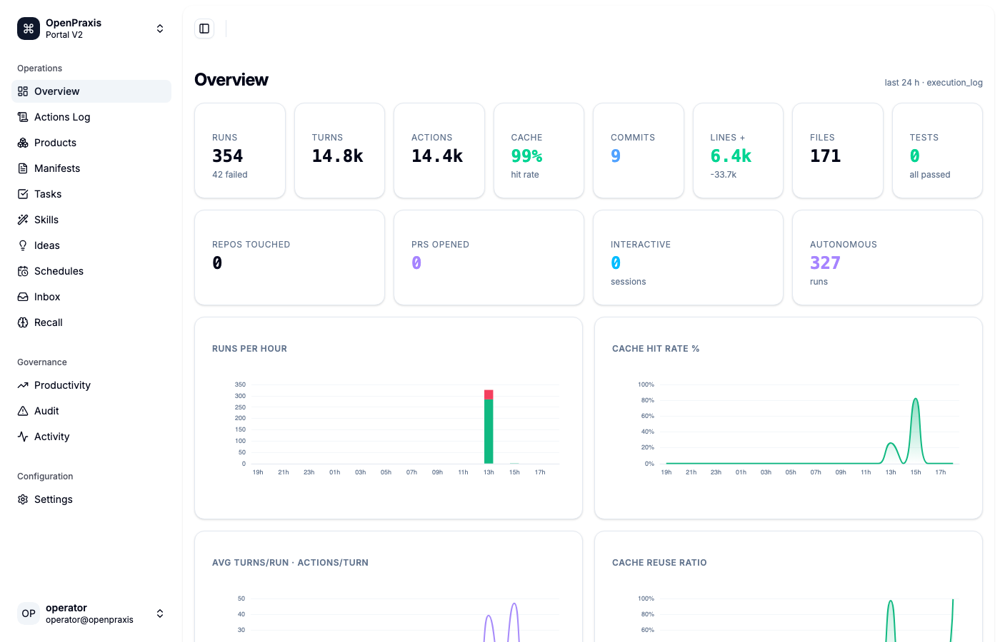
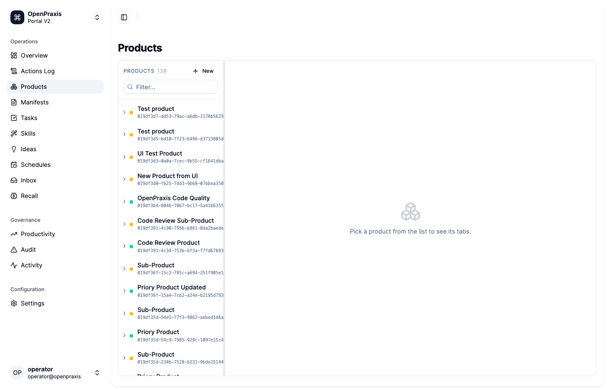
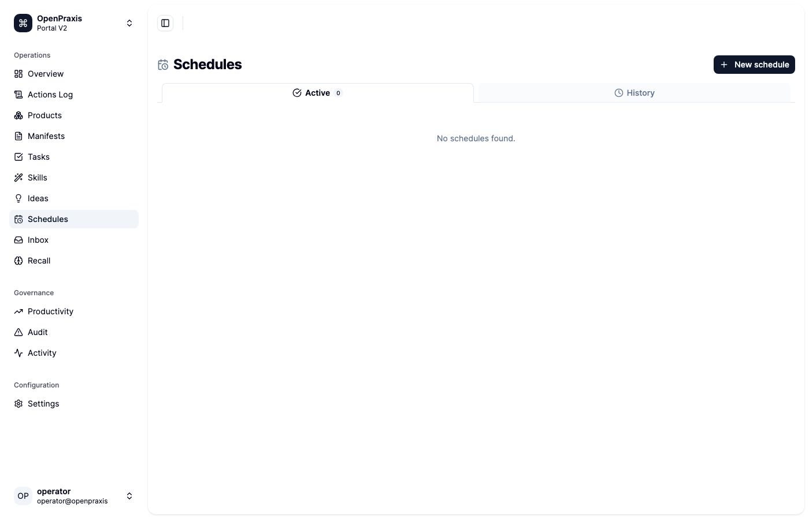

# Changelog

Moved out of the main README to keep the landing page focused on what OpenPraxis **is** rather than what just changed. See the ["Changelog" link in the README](../README.md#deeper-references) to land here from the top of the repo.

## v0.6.0 — May 2026

### Entity Unification + Execution Log Architecture

**The most significant architectural change since v0.1.** Collapses five separate entity tables into one unified `entities` table and rewrites all execution tracking into a single append-only `execution_log`.

#### Core architecture changes

- **`entities` table (SCD-2)** — all entity types in one table: `product | manifest | task | idea | skill`. Every change creates a new row; time travel is native.
- **`execution_log` (append-only, event-sourced)** — every run writes `event=started → sample (every 5s) → completed|failed` with full metrics: turns, actions, tokens, CPU, RSS, lines, commits, tests.
- **13 legacy tables dropped** at startup: `products`, `manifests`, `ideas`, `task_runs`, `task_run_host_samples`, `task_dependency`, `product_dependencies`, `manifest_dependencies`, `idea_manifest_links`, `task_manifests`, `task_runtime_state`, `execution_log_samples`, `execution_log_legacy`, `model_pricing`.
- **`relationships` table** is the single source for all edges (owns, depends_on, links_to) across all entity types.
- **`comments` table** stores all text content (descriptions, notes, decisions) for every entity type.
- **`schedules` table (SCD-2)** drives when entities run — the scheduler reads this, not the tasks table.

#### Interactive session tracking

Claude Code sessions now write to `execution_log` in real time:
- MCP `AfterInitialize` → `event=started` row
- Every 5 seconds → `event=sample` row (CPU/RSS from system sampler)
- Every 30 seconds → `event=sample` row with full transcript metrics (turns, tokens, cache hit rate)
- `SessionEnd` hook → `event=completed` row with final transcript metrics

#### New portal features

- **Overview page** — 8 stat cards + 8 ECharts pulled from `execution_log` and git history: runs per hour, cache hit rate trend, avg turns/run, cache reuse ratio, lines added/removed, commits per hour, terminal reasons donut, interactive vs autonomous split.
- **Unified entity menus** — all 5 entity types (Products, Manifests, Tasks, Skills, Ideas) use one identical component: expand arrow, `+ New` button, status dot, full UUID, latest first.
- **Skills + Ideas** — added to sidebar with dedicated routes and full entity detail (Main · Execution · Comments · Dependencies · DAG).
- **Schedules page** — standalone tab with Active / History tabs and a create form.
- **Git productivity** — `GET /api/stats/git` reads real commit history and merges with execution_log for lines/commits/files charts.
- **Cost removed** — all hardcoded pricing rates deleted. Cost will be redesigned with a proper billing integration.

#### Breaking changes

- `/api/products`, `/api/manifests`, `/api/tasks` CRUD endpoints removed. Use `/api/entities?type=<kind>`.
- `product_create`, `manifest_create`, `task_create` MCP tools removed. Use `entity_create`.
- Stats and Schedule tabs removed from entity detail. Will be rebuilt from `execution_log`.

#### Screenshots

| Overview | Products | Schedules |
|----------|----------|-----------|
|  |  |  |

## v0.5.0 — May 2026

### Breaking changes

- **`:9766` retired.** Portal V2 is now the only dashboard and serves on `:8765`. Any bookmark or script pointing at port 9766 must be updated.
- **`--portal-v2-port` flag removed.** Passing this flag to `openpraxis serve` now errors. Remove it from start scripts.

### Legacy portal removed ([#325](https://github.com/k8nstantin/OpenPraxis/pull/325))

17,000+ lines of legacy vanilla-JS dashboard code deleted: `views/`, `components/`, `vendor/`, `assets/`, `app.js`, `api.js`, `style.css`, `index.html`, `tree.js`, `lifecycle.js`, `task-status.js`. The dual-port architecture is gone — one binary, one port (`:8765`), one dashboard.

The React dashboard (Vite + React 19 + Tailwind v4 + TanStack Router + shadcn/ui) is now the canonical UI. It is embedded directly in the Go binary via `go:embed all:ui/dashboard-v2/dist` and served by the primary `Handler()` function.

`handler_v2.go` has been deleted — its functionality is merged into `handler.go`. The `Makefile` build pipeline now builds only the React dashboard before `go build`.

### Dashboard layout

Portal V2 organises the sidebar into three groups:

- **Operations** — Overview, Actions Log, Products, Manifests, Tasks, Inbox, Recall
- **Governance** — Productivity, Audit, Activity
- **Configuration** — Settings

Execution controls are presented as semicircle dial gauges (not sliders) at every scope level (task → manifest → product → system).

## April 2026

Landed on `main` between 2026-04-20 and 2026-04-22.

### Reliability

- **Watcher is observer-only ([#149](https://github.com/k8nstantin/OpenPraxis/pull/149)).** Removed the gatekeeper path that was mutating task state + blocking `ActivateDependents` on gate failure. Audits still run; findings post as `watcher_finding` comments; the paired review task owns the verdict. Fixes the "ops-task with zero commits auto-downgraded to failed" bug that stranded INT MySQL backup chains.
- **Task `depends_on` display widened 8 → 14 chars ([#145](https://github.com/k8nstantin/OpenPraxis/pull/145)).** UUIDv7 tasks created in the same millisecond share an 8-char time prefix, so the old `task_get` output rendered every child as if it pointed at the same parent. Now unambiguous.
- **Scheduler cleanup rule for cancelled recurring tasks.** `task_cancel` on a task with `schedule: 30m` is now durable: status flips to `cancelled`, schedule collapses to `once`, `next_run_at` clears, so the runner can't re-fire it. (Operational tooling, not a PR — directly applied.)

### DAG renderer — one-and-done

- **Dagre layout ([#158](https://github.com/k8nstantin/OpenPraxis/pull/158)).** Deleted 80+ lines of hand-rolled column/row arithmetic + manual topo sort + per-manifest DFS. Replaced with `layout: { name: 'dagre', rankDir: 'TB', ... }`. Any DAG shape — linear chain, independent pairs, multi-parent fan-in, empty manifests — now renders correctly with no layout-specific code.
- **Edges from real `depends_on` ([#146](https://github.com/k8nstantin/OpenPraxis/pull/146), kept through #158).** Product → manifest (ownership), manifest → manifest (explicit deps), parent-task → child-task (`depends_on`), manifest → task (ownership for in-manifest roots).
- **Local vendor bundle ([#159](https://github.com/k8nstantin/OpenPraxis/pull/159)).** Cytoscape + dagre + cytoscape-dagre pinned and served from `/vendor/`, not a CDN. Dashboard works offline; no silent break when a CDN hiccups.
- **Extract + contract test ([#160](https://github.com/k8nstantin/OpenPraxis/pull/160)).** Diagram code moved out of the 900-line `products.js` into `views/product-dag.js`. Added `TestProductHierarchy_EmptyProduct / _LinearChain / _ParallelPairs` in `handlers_product_hierarchy_test.go` so the API contract dagre rides on is locked at build time.

### Search

- **Keyword-first search for conversations + actions ([#152](https://github.com/k8nstantin/OpenPraxis/pull/152)).** New envelope response `{ items, total, offset, limit, has_more, semantic? }`. Infinite scroll appends pages. `<mark>`-highlighted snippets around the first literal match, 80 chars of context each side. Conversations get an optional "Related by meaning" semantic tail on page 0 (capped at 10, deduped). Actions stay keyword-only (already LIKE-based).

### Execution controls

- **Model selector is an enum ([#151](https://github.com/k8nstantin/OpenPraxis/pull/151)).** `default_model` moved from free-form string to `KnobEnum` with the Claude family (`""` agent default, `claude-opus-4-7`, `claude-sonnet-4-6`, `claude-haiku-4-5`). Dashboard renders as a `<select>`; typos rejected at validation.

### Comments + target resolution

- **Short-marker target IDs resolve everywhere.** `comment_add` + HTTP comment endpoints accept 8–12 char markers or full UUIDs; both paths canonicalize via the entity stores before writing ([#136](https://github.com/k8nstantin/OpenPraxis/pull/136), [#139](https://github.com/k8nstantin/OpenPraxis/pull/139)). Sweep migration for legacy short-marker orphans shipped as `openpraxis admin migrate-comment-orphans` ([#141](https://github.com/k8nstantin/OpenPraxis/pull/141)).
- **`execution_review` enforcement ([#118](https://github.com/k8nstantin/OpenPraxis/pull/118)).** Task completion blocked unless the agent posted its post-run retrospective.

### Branding

- **OpenPraxis mark ([#161](https://github.com/k8nstantin/OpenPraxis/pull/161)).** Sidebar glyph swapped for a transparent 256×256 PNG served from `/assets/openpraxis-icon.png`. Favicon + apple-touch-icon wired at the same path.
